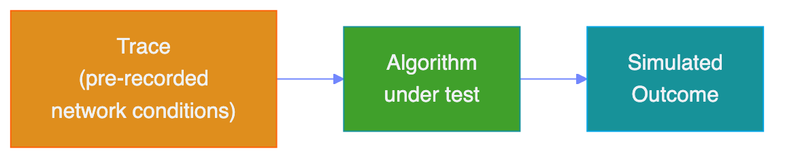

# **CausalSim**

### A Causal Framework for Unbiased Trace-Driven Simulation

Abdullah Alomar, Pouya Hamadanian, Arash Nasr-Esfahany,
Anish Agarwal, Mohammad Alizadeh, Devavrat Shah

---

# What is Trace-Driven Simulation?

**Real System:**

**Trace-Driven Simulation:**

- Assumption: the trace is **independent** of the algorithm

---

# The Problem

- **Trace-driven simulation** is widely used to evaluate new algorithms
- Current simulators assume new implementation would not affect trace validity
- But traces are **biased** by algorithmic choices made during collection
- Replaying biased traces under a new algorithm leads to **incorrect results**

---

# Key Insight

The data collected under one algorithm does not directly tell us what would have happened under a **different** algorithm

This is a **causal inference** problem:
- Observed traces are *factual* outcomes
- We need to estimate *counterfactual* outcomes

---

# CausalSim Approach

1. **Randomized Control Trial (RCT):** Collect traces under a fixed set of algorithms with randomized assignment
2. **Learn causal model:** Recover latent system conditions and system dynamics from the RCT data
3. **Simulate new algorithms:** Use the learned model to generate unbiased counterfactual traces

---

# Technical Core: Tensor Completion

- The problem maps to **tensor completion with extremely sparse observations**
- Each entry represents the outcome under a specific (user, time, algorithm) tuple
- Only one algorithm is observed per (user, time) pair
- CausalSim recovers the missing entries by learning latent factors that capture underlying system state

---

# Evaluation

- Validated on **10+ months** of real data from the **Puffer** video streaming system
- Compared against standard trace-driven simulation baselines

### Results
- **53% average error reduction** in one evaluation setting
- **61% average error reduction** in another setting
- Consistently more accurate across diverse algorithm comparisons

---

# Summary

- Trace-driven simulation suffers from **causal bias** -- a largely overlooked problem
- CausalSim provides a principled framework using **causal inference** and **tensor completion**
- Demonstrated significant accuracy improvements on real-world streaming data
- General framework applicable beyond networking

**Paper:** [arXiv:2201.01811](https://arxiv.org/abs/2201.01811)
