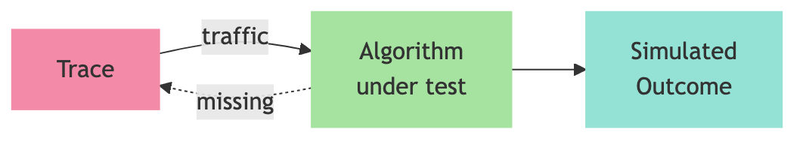

# My Title 

## Lorem Ipsum

My name

---

# What is Trace-Driven Simulation?

Example mermaid diagram:

---

# The Problem

- Lorem Ipsum
- Lorem *something* Ipsum
- Lorem ** Important** Ipsum

---

# Example: Cache Replacement

Cache with 3 slots. Trace collected under True LRU:

| Request | Action       | Cache state   | Result |
|---------|-------------|---------------|--------|
| A       | load A      | [A, -, -]     | miss   |
| B       | load B      | [A, B, -]     | miss   |
| C       | load C      | [A, B, C]     | miss   |
| A       | hit         | [B, C, A]     | hit    |
| D       | evict B     | [C, A, D]     | miss   |
| B       | evict C     | [A, D, B]     | miss (user retries B) |

---

# Baseline: ExpertSim

**Math** uses formula like a mathematician:

$$b_{t+1} = \max(0, \; b_t - s_t / \hat{c}_t) + T$$

- $b_t$: buffer size

---

# Adding Cards

Example to use cards

<h3>1. Lorem Ipsum</h3>

hmm

<h3>2. Lorem Ipsum</h3>

hmm

<h3>3. Lorem Ipsum</h3>

hmm

